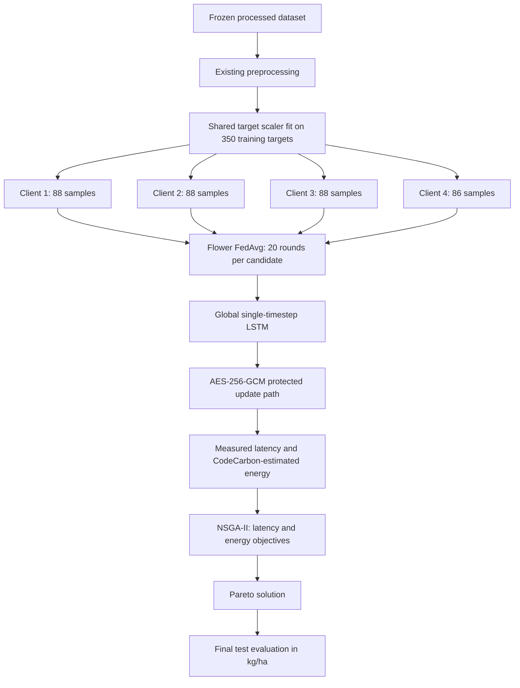

# Architecture overview

The final comparison uses the frozen 350/75/75 train/validation/test split and 38 preprocessed features. The LSTM input is one timestep, `(samples, 1, 38)`, with `LSTM(64) → Dense(32, ReLU) → Dense(1)`.

Before distributing client data, the runner fits one `StandardScaler` on the complete 350-row training target population only. The same mean and scale are passed to all four Flower clients; clients do not fit separate scalers. They train against normalized targets. Validation and final predictions are inverse-transformed with those same parameters and scored in kg/ha. The frozen test split is loaded only after the NSGA-II candidate and final baseline configurations are selected.

Flower clients send serialized model weights as opaque AES-256-GCM payloads. The server authenticates/decrypts each payload, performs sample-count-weighted FedAvg, then encrypts the global parameters before redistributing them. This provides confidentiality and ciphertext integrity/authentication for the update payload. The four clients and server run on one host over loopback; the edge/cloud comparison is a logical local simulation, not a deployment on separate devices.

Candidate latency is the sum of measured Flower round durations. Candidate energy is the sum of CodeCarbon whole-machine software estimates when available. NSGA-II minimizes measured latency and estimated energy as separate objectives. See `docs/emo_methodology.md` and the performance methodology files.
